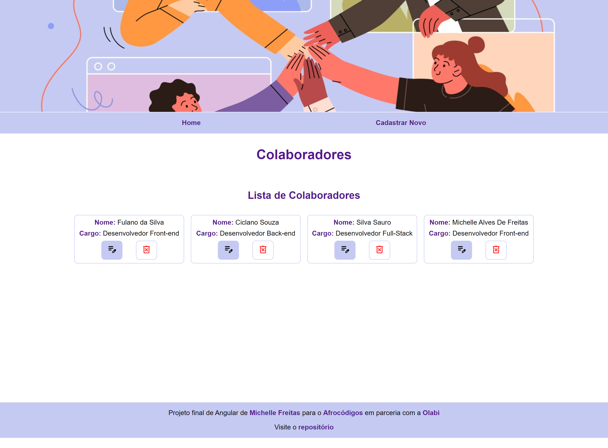
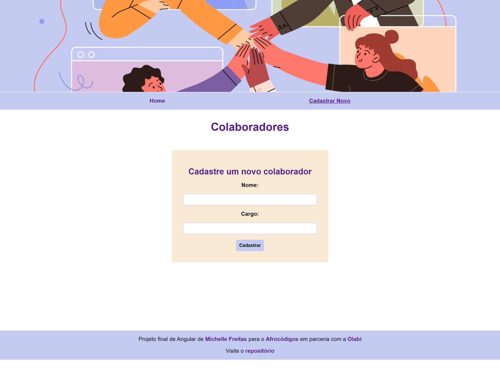
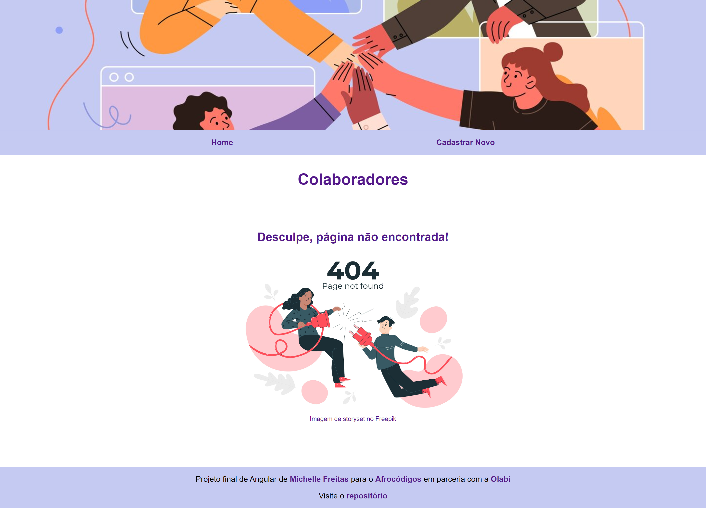

# PROJETO FINAL (ANGULAR)
### Turma de Front-end do Afrocódigos

### 💻 Projeto

Página de listagem de colaboradores desenvolvida com Angular e TypeScript, utilizando rotas para exibir a listagem e formulário de cadastro.

Utilizado os métodos HTTP's: GET, POST, PUT, DELETE. Para isso uma API foi mockada com o json-server http://localhost:3000/collaborators. Possibilitando listar, cadastrar, editar e deletar

[Visite a página no S3 - AWS *](http://afrocodigos-front-michelle-freitas.s3-website-sa-east-1.amazonaws.com/home)

*_Porém a api é apenas simulada localmente, ao entrar no link abaixo não é possível executar estes métodos, sendo necessário clonar este repositório._


#### HOME com lista de colaboradores



#### Formulário para cadastro de novo colaborador



#### Página não encontrada



### 🚀 Tecnologias
Esse projeto foi desenvolvido com as seguintes tecnologias:

- Angular
- Json-server
- Google icons

### Executando
Após clonar o repositório, acesse a pasta do projeto e execute os comandos abaixo:

```
npm install
npm run api
npm start
```

Acesse http://localhost:4200/ para visualizar a aplicação.
